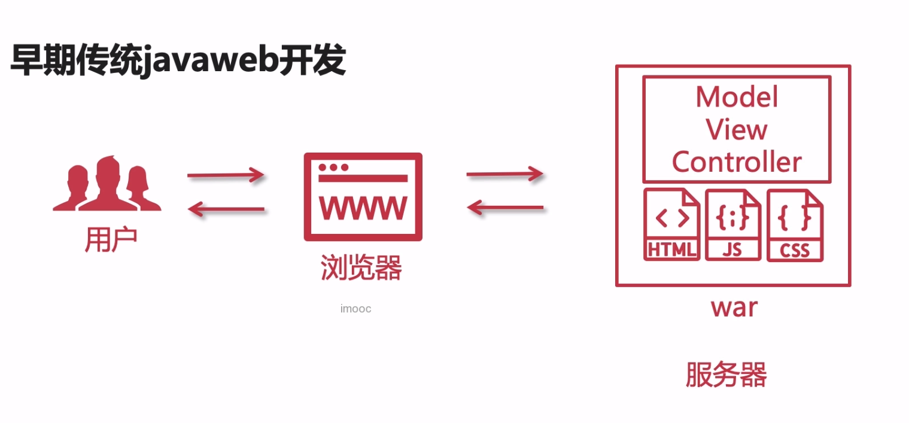
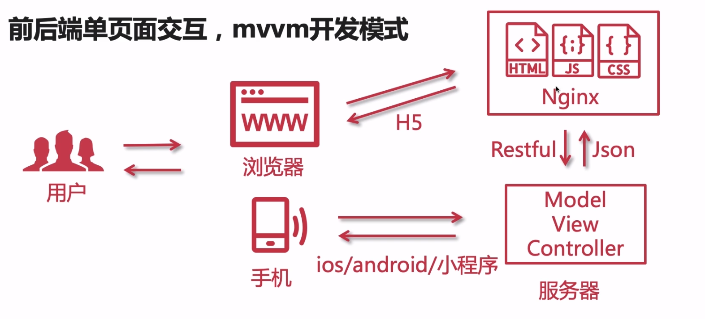
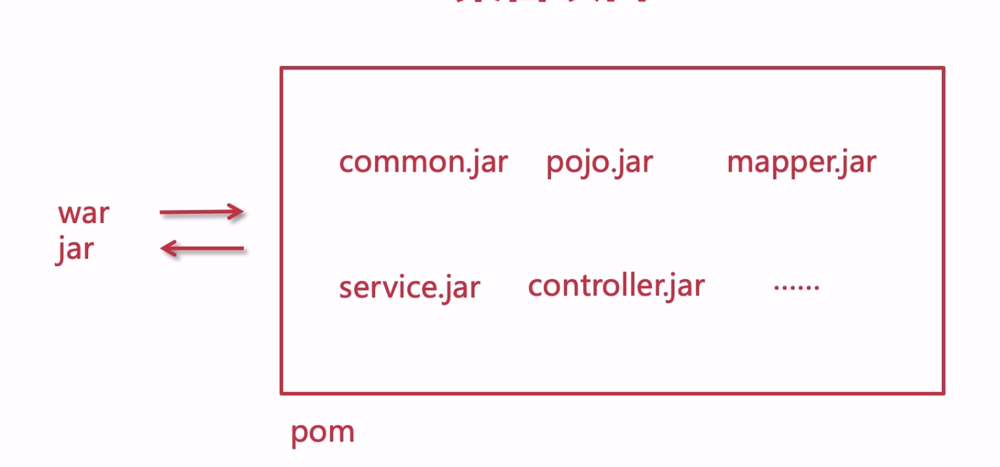

## 项目开发流程

1. 基于 SpringBoot2.x实现单体架构设计与准备工作
2. 实现单体电商项目核心功能开发
3. 实现单体电商项目个人中心功能
4. 项目部署与上线

## 项目演示
演示地址：http://shop.t.mukewang.com/

## 技术选型
1. 前后端分层
2. 后端分层架构模式
3. 需求分析，数据库表设计
4. SpringBoot Spring MyBatis 框架整合 

### SpingMvc VS SpringBoot
1. SpringMVC 是框架，SpringBoot 是工具
2. SpringMVC的配置很繁琐，SpringBoot不需要配置
3. SpringBoot 继承了多样化的中间件（开箱即用）
4. SpringBoot内置了Tomcat

### Struts(十年前非常火的框架)
1. 存在安全漏洞
2. 高并发情况之下，变量会共享
3. Filter拦截
4. 与Sping 整合较为复杂（重）

### 前端技术选型
1. MVVM开发模式
2. Jquery、VUE
3. html
4. css

## 技术选择所要考虑的问题
1. 切合业务
2. 社区活跃度
3. 团队技术水平
4. 版本更新迭代周期
5. 试错精神（多尝试）
6. 安全性
7. 成功案列
8. 开源精神

## 前后端分离开发模式

## 项目拆分与聚合
