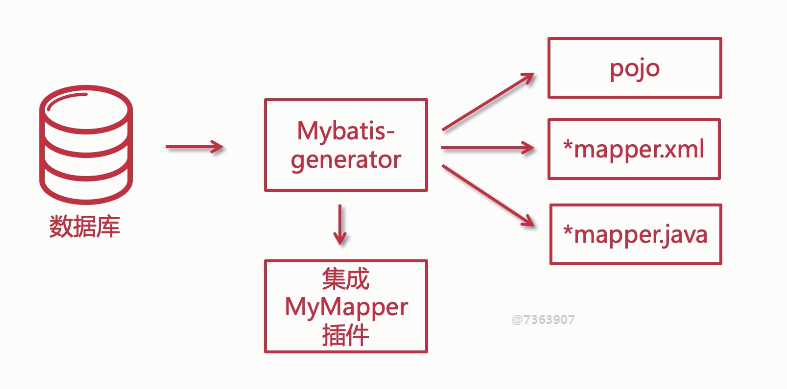
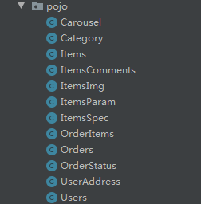
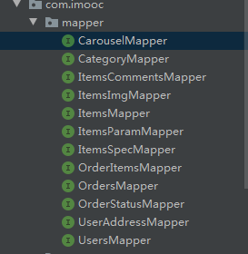
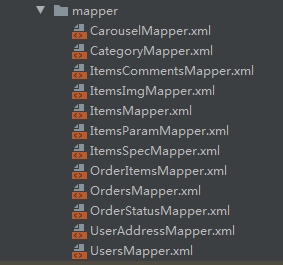

## MyBatis 逆向生成工具： Generator



### 使用过程

####  生成文件

使用 mybatis-generator-for-imooc 实体类生成项目生成项目所需文件，生成的文件包含：








#### 复制文件到聚合项目

主要对应的位置，包名的修改

#### 在项目中添加对应的配置

1. 在pom中添加通用mapper工具的依赖

```xml
<dependency>
    <groupId>tk.mybatis</groupId>
    <artifactId>mapper-spring-boot-starter</artifactId>
    <version>2.1.5</version>
</dependency>
```
2. 在yml添加mapper配置

```yml
# 通用 Mapper 配置
mapper:
  mappers: com.imooc.my.mapper.MyMapper
  not-empty: false
  identity: MYSQL
```

3. 引入MyMapper接口类

```java
package com.zch.my.mapper;

import tk.mybatis.mapper.common.Mapper;
import tk.mybatis.mapper.common.MySqlMapper;

/**
 * 继承自己的MyMapper
 */
public interface MyMapper<T> extends Mapper<T>, MySqlMapper<T> {
}
```