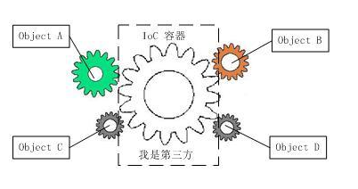

https://juejin.im/post/6880152304515973133#heading-15

## IOC 思想

**IOC（控制反转）是一种依赖倒置原则的代码设计的思路，它主要采用（DI）依赖注入的方式来实现**

### 不使用IOC思想的传统模式

在传统模式中对象由程序员主动创建，控制权掌握在程序员手中。程序可以做到正常工作，但仍有一个难以避免的问题。**如果用户需求变更**，程序员就要修改对应的代码，代码量不大还好，如果代码量巨大的话 修改一次的成本也和大。这个问题就是**耦合性过高**引起的，修改一次需求，或多或少会造成代码的修改，工作量先不说，维护起来也是极其不便的啊。


就如上图中这四个齿轮（对象）一样，互相啮合，如果有一方停止或更换 其他的齿轮也就没办法工作，这自然不是我们希望看到的。

>  为了解决对象间耦合过高的问题，软件专家Michael Mattson提出了IoC理论，用来实现对象之间的“解耦”。

那么应当如何达到效果呢？


### 使用 IOC 的思想后

**IoC的主要思想是借助一个“第三方”来拆开原本耦合的对象，并将这些对象都与“第三方”建立联系，由第三方来创建、操作 这些对象，进而达到解耦的目的。**



**因此IoC容器也就成了整个程序的核心，对象之间没有了联系（但都和IoC容器有联系）。**


这里引用一句知乎上看到的话

> IoC的思想最核心的地方在于，资源不由使用资源的双方管理，而由不使用资源的第三方管理，这可以带来很多好处。第一，资源集中管理，实现资源的可配置和易管理。第二，降低了使用资源双方的依赖程度，也就是我们说的耦合度。

### 什么是反正控制

这里 我们引入一个场景：**如果对象A 想调用对象B。**

#### 传统模式中

在A对象中创建一个B对象实例，就可以满足A对象调用B对象的需求。**这是我们在A对象中主动的去创建B对象**

#### 引入IoC后

 A对象如果想调用B对象，IoC容器会创建一个B对象注入到A对象中，这样也可以满足A对象的调用需求。但是过程由我们的主动创建，变成了A对象**被动的去接收IoC容器注入的B对象**

A对象依赖B对象的过程，由程序员的**主动**创建B对象供其依赖，变为了**被动**的接收IoC容器注入的对象。控制权从程序员手中交到了IoC容器手中。A对象获得依赖的过程也由主动变为被动，这就是所谓的**控制反转**

### 什么是 依赖注入（DI）

依赖注入是IoC思想最主要的**实现方式**，也就是上文提到的 **A对象如果想调用B对象，IoC容器会创建一个B对象注入到A对象中，这样就可以满足A对象对B对象的依赖需求。**这个行为就是**依赖注入**。

#### DI≠IoC

IoC的概念更宽广一些，而DI是IoC的主要实现方式，但这并不意味着DI就是IoC，将二者混为一谈 这是不对的，很容易误导他人。

> 就比如你想要阅读，最主要的实现方式自然是“用眼睛长时间的去看”，但你不能把这个“眼睛长时间去看”的行为 理解为阅读。（可能例子有点不恰当）

#### 注入方式

##### 一.setter方法注入

我们需要在类中生成一个set方法~~和一个空构造~~（空构造在没有声明有参构造时会隐式声明，无需再进行多余的操作）

```java
public class Hello {
    
    private String name;
    // 一定要生成set方法
    public void setName(String name) {
        this.name = name;
    }
    public String getName() {
        return name;
    }
}
```

在Spring配置文件中注入Bean（对象），在Bean中使用property标签为name属性赋值

```xml
<bean id="hello" class="com.molu.pojo.Hello">
    <!--setter方法注入使用property标签-->
    <property name="name" value="陌路"/>
</bean>
```
写一个简单的测试方法，测试property标签是否成功赋值（是）。


##### 二.构造器注入

先需要手动生成一个有参构造

```java
package com.molu.pojo;

public class Hello {

    private String name;
    // 生成有参构造
    public Hello(String name) {
        this.name = name;
    }
    public String getName() {
        return name;
    }
    public void setName(String name) {
        this.name = name;
    }
}

```

配置文件中注入bean对象

```xml
<!-- 通过下标赋值 -->
<bean id="hello" class="com.molu.pojo.Hello">
    <constructor-arg index="0" value="陌路"/>
</bean>

<!-- 通过参数类型赋值(不推荐，参数类型容易重合) -->
<bean id="hello" class="com.molu.pojo.Hello">
    <constructor-arg type="java.lang.String" value="陌路"/>
</bean>

<!-- 通过参数名赋值（推荐）-->
<bean id="hello" class="com.molu.pojo.Hello">
    <constructor-arg name="name" value="陌路"/>
</bean>
```


其它注入参考 [Spring官网](https://docs.spring.io/spring-framework/docs/current/spring-framework-reference/core.html#beans-c-namespace)

#### 补充

**注册进applicationContext.xml中的bean，无论你调用与否，他都会被初始化**


## AOP编程

>​		在软件业，AOP为Aspect Oriented Programming的缩写，意为：面向切面编程，通过预编译方式和运行期间动态代理实现程序功能的统一维护的一种技术。AOP是OOP的延续，是软件开发中的一个热点，也是Spring框架中的一个重要内容，是函数式编程的一种衍生范型。利用AOP可以对业务逻辑的各个部分进行隔离，从而使得业务逻辑各部分之间的耦合度降低，提高程序的可重用性，同时提高了开发的效率。
>​		Spring的关键组件之一是AOP框架。尽管Spring IoC容器不依赖于AOP，但AOP是对Spring IoC的补充，以提供功能非常强大的中间件解决方案。
>
>

在涉及AOP之前我们先简单了解一下**代理模式**，因为代理模式是SpringAOP的底层实现。


### 代理模式

> 代理模式是23种设计模式之一，它分为动态代理和静态代理，代理模式可以使客户端的访问对象从真实对象变为代理对象。

为什么这么做呢？

**代理模式可以屏蔽用户对真实对象的访问，这样可以避免一些安全上的问题。也能够做到不改变真实对象，对真实对象的功能进行扩展（代理对象实现附加操作进行扩展）。真实对象的功能更加纯粹，业务的分工更加明确。**

那么如何实现代理模式呢？

- 首先需要一个抽象主题（接口或者抽象类）

- 创建代理对象和真实对象

- 代理对象和真实对象都实现该抽象主题

- 客户端访问代理对象

  