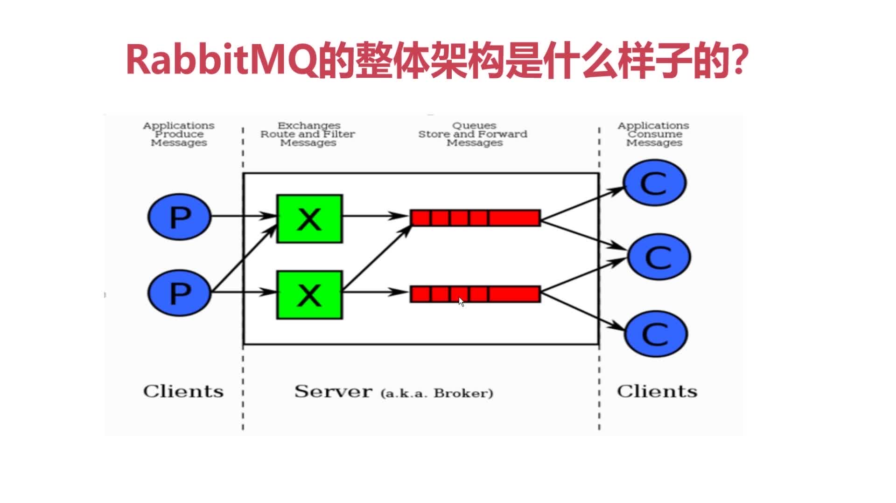
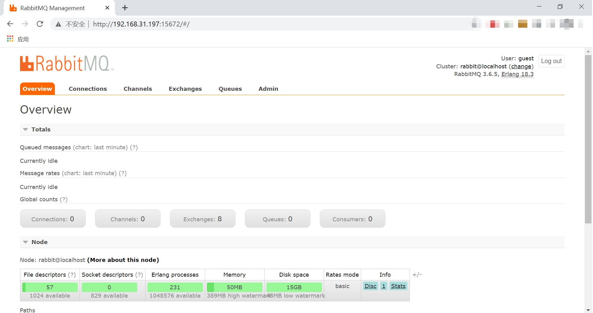

# 认识RabbitMQ

## RabbitMQ简介

RabbitMQ 是采用 Erlang 语言实现 AMQP(Advanced Message Queuing Protocol，高级消息队列协议）的消息中间件

主要特点：

- **可靠性：** RabbitMQ使用一些机制来保证消息的可靠性，如持久化、传输确认及发布确认等。
- **灵活的路由：** 在消息进入队列之前，通过交换器来路由消息。对于典型的路由功能，RabbitMQ 己经提供了一些内置的交换器来实现。针对更复杂的路由功能，可以将多个交换器绑定在一起，也可以通过插件机制来实现自己的交换器。这个后面会在我们将 RabbitMQ 核心概念的时候详细介绍到。
- **扩展性：** 多个RabbitMQ节点可以组成一个集群，也可以根据实际业务情况动态地扩展集群中节点。
- **高可用性：** 队列可以在集群中的机器上设置镜像，使得在部分节点出现问题的情况下队列仍然可用。
- **支持多种协议：** RabbitMQ 除了原生支持 AMQP 协议，还支持 STOMP、MQTT 等多种消息中间件协议。
- **多语言客户端：** RabbitMQ几乎支持所有常用语言，比如 Java、Python、Ruby、PHP、C#、JavaScript等。
- **易用的管理界面：** RabbitMQ提供了一个易用的用户界面，使得用户可以监控和管理消息、集群中的节点等。在安装 RabbitMQ 的时候会介绍到，安装好 RabbitMQ 就自带管理界面。
- **插件机制：** RabbitMQ 提供了许多插件，以实现从多方面进行扩展，当然也可以编写自己的插件。感觉这个有点类似 Dubbo 的 SPI机制。

## 什么是 AMQP 高级消息队列协议

AMQP，即Advanced Message Queuing Protocol，一个提供统一消息服务的应用层标准高级队列协议，是应用层协议的一个开放标准，为面向消息的中间件设计。

- **SERVER：**又称broker，接收接受客户端的链接，实现AMQP实体服务
- **Connection:** 连接， 应用程序与Broker的网络连接。
- **Channel：** 网络信道，几乎所有的操作都在Channel进行，Channel是进行消息读写的通道。客户端可以建立多个Channel，每个Channel代表一个会话任务。
- **Message：** 消息，服务器和应用程序之间传送的数据，由properties和Body组成。properties可以对消息进行修饰，比如消息的优先级、延迟等高级特性，body就是消息体的内容。

- **Virtual host：**虚拟地址，用于进行逻辑隔离，最上层的消息路由。一个Virtual host 里面可以有若干个Exchange 和 Queue，同一个Virtual host不能有相同名称的Exchange或Queue。
- **Exchange：**交换机，接收消息，根据路由键转发消息到绑定的队列。
- **Binding：** Exchange 和 Queue 之间的虚拟连接，Binding 中可以包含Routing key。
- **Routing key：**一个路由规则，虚拟机可以用它来确定如何路由宇哥特定的消息。
- **Queue：**也称为Message Queue，消息队列，保存消息并将它们转发给消费者。

## RabbitMQ核心概念

RabbitMQ整体架构：

# 安装RabbitMQ
1. 首先在Linux上进行一些软件的准备工作，yum下来一些基础的软件包
yum install build-essential openssl openssl-devel unixODBC unixODBC-devel make gcc gcc-c++ kernel-devel m4 ncurses-devel tk tc xz

2. 下载RabbitMQ所需软件包（.在这里使用的是 RabbitMQ3.6.5 稳定版本）
wget www.rabbitmq.com/releases/erlang/erlang-18.3-1.el7.centos.x86_64.rpm
wget http://repo.iotti.biz/CentOS/7/x86_64/socat-1.7.3.2-1.1.el7.lux.x86_64.rpm
wget www.rabbitmq.com/releases/rabbitmq-server/v3.6.5/rabbitmq-server-3.6.5-1.noarch.rpm

3. 安装服务命令
rpm -ivh erlang-18.3-1.el7.centos.x86_64.rpm 
rpm -ivh socat-1.7.3.2-1.1.el7.x86_64.rpm
rpm -ivh rabbitmq-server-3.6.5-1.noarch.rpm

4. 修改用户登录与连接心跳检测，注意修改
vim /usr/lib/rabbitmq/lib/rabbitmq_server-3.6.5/ebin/rabbit.app
修改点1：loopback_users 中的 <<"guest">>,只保留"guest"（用于用户登录）
修改点2：heartbeat 为10（用于心跳连接）

5. 启动服务(后面 | 包含了停止、查看状态以及重启的命令)
/etc/init.d/rabbitmq-server start | stop | status | restart

6. 查看服务有没有启动： lsof -i:5672 （5672是Rabbit的默认端口）
rabbitmq-plugins enable rabbitmq_management
可查看管理端口有没有启动： 
lsof -i:15672 或者 netstat -tnlp | grep 15672

7. 虚拟机安装可能需要关闭防火墙
systemctl stop firewalld.service

一切OK 我们访问地址，输入用户名密码均为 guest ：http://你的ip地址:15672/

